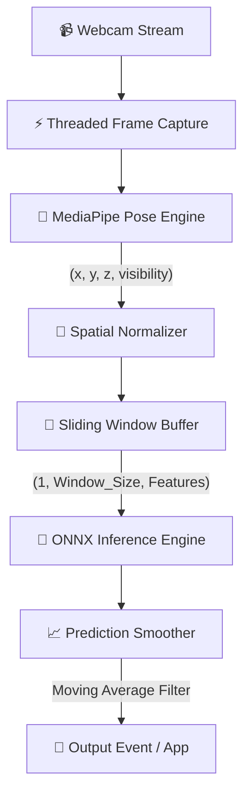

# 🖐️ Real-Time Gesture Recognition Engine

[](https://www.python.org/)
[](LICENSE)

Un'architettura **production-ready**, modulare ed ultra-performante per il **riconoscimento di gesture/movimenti in tempo reale** da flussi video RGB/webcam. 

Il sistema adotta un approccio **Two-Stage Architecture**, disaccoppiando l'estrazione visiva delle feature dalla classificazione sequenziale temporale per garantire un'inferenza ad altissima frequenza (**< 5ms** per frame su CPU).

---

## 🏗️ Architettura del Sistema

A differenza dei classici approcci pesanti basati su 3D-CNN o Video Transformers, il sistema separa nettamente le responsabilità:



1. **Feature Extraction (Stage 1):** Utilizza **MediaPipe Pose** per convertire ogni frame in un vettore spaziale compatto (33 landmark 3D).
2. **Spatial Normalization:** Applica trasformazioni matematiche per garantire l'invarianza a scala, traslazione e posizione dell'utente rispetto alla fotocamera.
3. **Temporal Sliding Window:** Accumula $N$ frame consecutivi (default: 30 frame = ~1 sec) in un buffer ad anello con complessità $O(1)$.
4. **Classification & Smoothing (Stage 2):** Esegue un'inferenza ultrarapida con **ONNX Runtime** ed stabilizza l'output con un filtro *Exponential Moving Average* anti-flicker.

---

## 📂 Struttura del Progetto

Il progetto segue i principi della **Clean Architecture / Architettura Esagonale**, mantenendo la logica di dominio completamente isolata da framework hardware o ML.

```text
gesture_recognition/
├── config/
│   └── settings.yaml             # Iperparametri, soglie, window size e configurazione cam
├── data/
│   ├── raw/                      # Video grezzi organizzati per sottocartelle di classe
│   └── processed/                # Datasets di landmark estratti e normalizzati (.npz)
├── src/
│   ├── domain/                   # Domain Core (Pure Python - No OpenCV/PyTorch)
│   │   ├── entities.py           # Dataclass immutabili: Landmark, FrameData, GesturePrediction
│   │   ├── interfaces.py         # Protocols/ABC per dipendenze disaccoppiate
│   │   └── normalizer.py         # Logica matematica pura di normalizzazione spaziale
│   ├── infrastructure/           # Implementazioni concrete delle dipendenze
│   │   ├── camera.py             # Threaded OpenCV VideoCapture (Non-blocking I/O)
│   │   ├── extractors/           # Estrattore MediaPipe Pose
│   │   ├── classifiers/          # Engine di inferenza ONNX Runtime
│   │   └── pipeline/             # Sliding Window Buffer & Prediction Smoother
│   ├── application/              # Orchestrazione Use Cases
│   │   ├── dataset_builder.py    # Pipeline di estrazione landmark da dataset video
│   │   ├── trainer.py            # Training 1D-CNN in PyTorch ed export ONNX
│   │   └── real_time_runner.py   # Main Loop di inferenza live con visual overlay
│   └── utils/
│       └── logger.py             # Logger di sistema thread-safe
├── tests/
│   ├── unit/                     # Test unitari deterministici (normalizzazione, buffer)
│   └── integration/              # Test di integrazione sulla pipeline
├── pyproject.toml
├── requirements.txt
└── main.py                       # Entry point CLI
